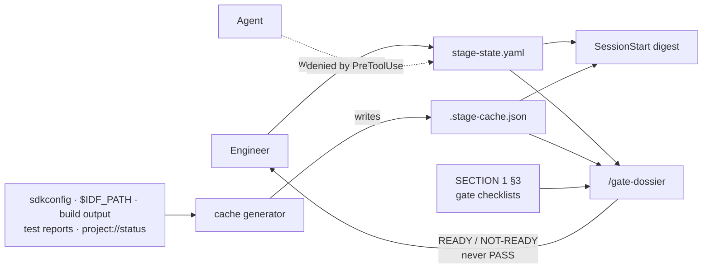

# STAGE_STATE_SCHEMA — `stage-state.yaml` Specification v1

**Role context:** Senior embedded/IoT systems architect addressing a mid-level engineer. All conventions defined in CLAUDE.md are inherited — this file applies them, does not restate them.

**Scope:** This file specifies the structure, ownership, and validation rules of `stage-state.yaml` and its generated companion `.stage-cache.json`. It does not define the stage model itself (SECTION 1), the trace record schema (SECTION 4), the PIC audit criteria (SECTION 6), or the repository location map (SECTION 7). It is referenced by all of them.

---

## 1. Purpose

`stage-state.yaml` is the single authored record of **where a project stands in the stage model and how it got there**. Every layer of agent support reads it: the session-start digest, the gate dossier, and the enforcement guards. Nothing else in the repository answers the question "which stage bar applies to the work I am doing right now."

It is deliberately small. Its value comes from what it refuses to hold as much as from what it holds.

---

## 2. Location and ownership

| Property | Value |
|---|---|
| **Path** | `stage-state.yaml` at project root |
| **Committed** | Yes |
| **Written by** | The engineer only |
| **Written by agent** | Never — enforced by a `PreToolUse` guard that denies any agent Write/Edit to this path |
| **Companion** | `.stage-cache.json` at project root, git-ignored, machine-generated, never hand-edited |



---

## 3. The separation rule

The file holds **decisions, intent, attestations, and their history**. It holds no fact that a machine can derive, because a hand-written derived fact goes stale silently and becomes a source of false confidence.

### 3.1 Prohibited in `stage-state.yaml`

| Prohibited content | Reason | Correct location |
|---|---|---|
| Installed ESP-IDF version | Changes without this file knowing | `.stage-cache.json` ← `$IDF_PATH/version.txt`, `ESP_IDF_VERSION_*`, or MCP `project://status` |
| `unicore`, `freertos_hz`, `psram`, core count, peripheral availability | Derived per target from `sdkconfig` / `soc_caps.h` | `.stage-cache.json` |
| Build status, warning count, artifact presence | Changes every build | `.stage-cache.json` |
| Any measured value — stack high-water-mark, heap, timing, RSSI, current, temperature | These are tier E0. Hand-writing one converts it into a tier E3 claim wearing an E0 costume | `.stage-cache.json` + the report file under `tests/reports/` |
| Open assumption count | Derived — computable by folding the `log:` section | Computed at fold time |
| Per-item gate status | Duplicates SECTION 1 §3 and provides a cheap checkbox that invites unevidenced claims | Computed — see §8 |
| Gate checklist content | Owned by SECTION 1 §3 | `WORKFLOW_SECTION1.md` |
| Assumption detail (statement, impact, owner, deadline, resolution) | Owned by the Assumption Register | `design/requirements/assumption-register.md` |
| Task, issue, or debt detail | Owned by SECTION 4 | `tracking/` |

### 3.2 Required in `stage-state.yaml`

Only what cannot be derived: the current stage, the enforcement level, declared intent, human attestations, and an append-only log of decisions.

---

## 4. Structure

```yaml
# stage-state.yaml — project root
# Authored by the engineer. Agent writes are denied by PreToolUse.
# Contains no derived facts — see .stage-cache.json and STAGE_STATE_SCHEMA §3.

schema_version: 1

project:
  id: node-gw-01                       # stable slug, never changes
  name: "Sensor Gateway Node"
  created: 2026-08-26

current:
  stage: S2                            # S1 | S2 | S3 | S4 | S5
  entered: 2026-08-26
  enforcement: guard                   # advisory | guard | strict — see §5
  intent:                              # declared intent, never measurement
    targets: [esp32, esp32s3]          # targets this project intends to support
    idf_pinned: "6.0.2"                # version pinned by the docs — compared against installed
  registers:                           # pointers, never copies
    assumptions: design/requirements/assumption-register.md
    debt: tracking/debt/
    tasks: tracking/tasks/
    issues: tracking/issues/

attestations:                          # only criteria a machine cannot evaluate — see §6
  - id: ATT-0003
    gate: "2->3"
    criterion: PIC-S2-05               # criterion ID from SECTION 1 §3 or SECTION 6 §2.2
    claim: "Stack sizing strategy documented; unit stated per API for every task"
    attested_by: <engineer>
    date: 2026-08-27
    method: agent-adversary
    dossier: gates/gate23-dossier-2026-08-27.md
    objections: { raised: 4, accepted: 3, rejected: 1 }
    evidence: design/architecture/system-architecture.md@a3f1c2
    supersedes: null

log:                                   # append-only — existing entries are never edited
  - { ts: 2026-08-26T09:14+07:00, event: stage_entered,
      stage: S2, by: <engineer>, from: S1 }
  - { ts: 2026-08-26T10:02+07:00, event: assumption_opened,
      id: ASM-S2-004, origin: agent-claim, tier: E3,
      subject: "MQTT TX queue depth sufficient for p99 WiFi outage",
      deadline: 2026-09-15 }
  - { ts: 2026-08-27T15:40+07:00, event: assumption_resolved,
      id: ASM-S2-004, resolution: measured, tier: E0,
      evidence: tests/reports/queue-depth-2026-08-27.log }
  - { ts: 2026-08-27T16:02+07:00, event: attestation_made,
      id: ATT-0003, criterion: PIC-S2-05, by: <engineer> }
  - { ts: 2026-08-28T09:00+07:00, event: gate_decided,
      gate: "2->3", decision: PASS, by: <engineer>,
      unmet: [], dossier: gates/gate23-dossier-2026-08-27.md }
```

### 4.1 Field reference

| Path | Type | Required | Notes |
|---|---|---|---|
| `schema_version` | int | Yes | See §9 |
| `project.id` | slug | Yes | Stable identifier; used to correlate across tooling |
| `project.name` | string | Yes | Human-readable |
| `project.created` | date | Yes | ISO 8601 date |
| `current.stage` | enum | Yes | `S1`–`S5` per SECTION 1 §2 |
| `current.entered` | date | Yes | Date the current stage was entered |
| `current.enforcement` | enum | Yes | `advisory` \| `guard` \| `strict` — see §5 |
| `current.intent.targets` | list | Yes | Targets the project *intends* to support. Not a capability claim — capabilities are derived per target in the cache |
| `current.intent.idf_pinned` | string | Yes | The ESP-IDF version the documentation pins. The cache compares it against the installed version and reports `idf_pin_match` |
| `current.registers.*` | path | Yes for `assumptions` | Pointers to the registers owned by SECTION 1 and SECTION 4 |
| `attestations[]` | list | Yes (may be empty) | See §6 |
| `log[]` | list | Yes | Append-only. See §7 |

---

## 5. `enforcement` — free field with a stage-derived default

`enforcement` is set by the engineer. It is not computed from the stage; the stage only supplies its default.

| Level | Active behaviour | Default at |
|---|---|---|
| `advisory` | Hooks inject context and warn at `Stop`. No `PreToolUse` denial. | **S1** |
| `guard` | `advisory` plus deterministic textual guards enforced at `PreToolUse` with `permissionDecision: deny`. The authoritative guard list is the registry in `tools/guards.py`, never a list written here or in the digest — see `hooks/GUARD_SPEC.md`. At `advisory` the same checks still run, but findings are surfaced as context and nothing is denied. Every denial is overridable by the engineer through the permission flow. | **S2, S3** |
| `strict` | `guard` plus evidence-path checks, numeric-claim checks (a figure in a document with no citation is rejected), and validator execution in CI. | **S4, S5** |

### 5.1 Raising and lowering

- **Raising above the stage default:** unrestricted. Requires one `enforcement_raised` log event. No reason required.
- **Lowering below the stage default:** requires an `enforcement_lowered` log event carrying both `reason` and `expires` (a date). This mirrors the risk-acceptance discipline of SECTION 1 §3, which recognises no undated relaxation. The purpose is not friction — it is to make the relaxation visible rather than silent.

### 5.2 Note for ESP-IDF v6.0.2 projects

The legacy-driver guard is worth enabling at **S1**, below its default. Code using the drivers removed in v6.0 fails to compile regardless; the guard only produces a clearer message earlier, at no cost.

---

## 6. Attestations

An attestation records a human judgement on a gate criterion that no machine can evaluate — for example "architecture diagram and ICDs reviewed, feedback resolved" or "core technical hypothesis demonstrated with measured data."

| Field | Required | Notes |
|---|---|---|
| `id` | Yes | `ATT-<NNN>`, monotonic within the project |
| `gate` | Yes | e.g. `"2->3"` |
| `criterion` | Yes | Criterion ID from SECTION 1 §3 or SECTION 6 §2.2 |
| `claim` | Yes | What is being attested, stated as a falsifiable sentence |
| `attested_by` | Yes | Named individual |
| `date` | Yes | ISO 8601 date |
| `method` | Yes | See §6.1 |
| `dossier` | Yes when `method: agent-adversary` | Path under `gates/` |
| `objections` | Yes when `method: agent-adversary` | `{raised, accepted, rejected}` |
| `evidence` | Yes | Artifact path plus content hash frozen at attestation time (`path@hash`) |
| `supersedes` | Yes (may be `null`) | ID of the attestation this replaces |

Attestations are never deleted. A superseded attestation remains in the file and gains an `attestation_superseded` log event.

### 6.1 `method: agent-adversary` — validity conditions

This is the standard method for a single-engineer project, where SECTION 6's assumption of a separate PIC does not hold. To prevent it degenerating into a rubber stamp, an attestation with this method is valid **only if all four conditions hold**:

```
[ ] dossier: points to a file that exists, produced by /gate-dossier
[ ] the dossier contains the adversary's objections, listed explicitly
[ ] every objection carries a disposition: accepted (became a gap, TASK, or ASM)
    or rejected with a written reason
[ ] objections.accepted + objections.rejected == objections.raised
```

An attestation failing any condition does not count as `HUMAN_ATTESTED`; its gate criterion remains `UNVERIFIABLE`. Conditions 1 and 4 are machine-checkable.

**Calibration signal.** A repeated `objections.raised: 0` is not good news — it indicates the adversary is not functioning. Because the count is logged, a run of zeros is observable and should trigger recalibration of the adversary prompt. This signal does not exist without the log.

### 6.2 Other methods

| Method | Meaning | Use |
|---|---|---|
| `agent-adversary` | Dossier with disposed adversary objections | Default for solo projects |
| `self-review-deferred` | Dossier authored on day X, reviewed on day X+1 without re-reading the original rationale | Acceptable at gates 1→2 and 2→3 |
| `external-review` | A named reviewer other than the author | Restores genuine second-pair-of-eyes; recommended for gates 3→4 and 4→5 if a reviewer is available |

---

## 7. Log event vocabulary

The log is append-only. Existing entries are never edited; corrections are made by appending.

**`ts` must carry both a time and an offset** (`2026-08-26T09:14:00+07:00`). A bare date folds to midnight, which can make a same-day log appear non-monotonic and trip the §10 consistency check.

| Event | Required fields | Notes |
|---|---|---|
| `stage_entered` | `stage`, `by`, `from` | `from: null` at project creation. A regression after a gate FAIL records the earlier stage in `from`, making regressions as visible as advances |
| `gate_decided` | `gate`, `decision`, `by`, `unmet[]`, `dossier` | `decision` is `PASS` or `FAIL` only — SECTION 1 §3 recognises no conditional pass. The agent never produces this event |
| `assumption_opened` | `id`, `origin`, `tier`, `subject`, `deadline` | `subject` is a short label only; the full record lives in the Assumption Register |
| `assumption_resolved` | `id`, `resolution`, `tier` | `resolution`: `measured` \| `confirmed` \| `designed-out` \| `invalidated` |
| `attestation_made` | `id`, `criterion`, `by` | Detail lives in the `attestations:` block |
| `attestation_superseded` | `id`, `superseded_by`, `reason` | The superseded attestation is retained |
| `enforcement_raised` | `to`, `by` | No reason required |
| `enforcement_lowered` | `to`, `by`, `reason`, `expires` | Waiver-shaped; expiry is mandatory |
| `waiver_granted` | `criterion`, `reason`, `expires`, `by` | Risk acceptance per SECTION 1 §3 and SECTION 6 §1.3 |
| `target_added` / `target_removed` | `target`, `reason` | Any change to `current.intent.targets` requires a trace |
| `schema_migrated` | `from`, `to` | Recorded when `schema_version` changes — see §11 |

### 7.1 `origin` on `assumption_opened`

| Value | Meaning |
|---|---|
| `agent-claim` | The assumption exists because an agent produced a tier E3 claim that could not be evidenced |
| `human` | Raised by the engineer during design or review |
| `field-incident` | Raised by a Stage 5 field incident |

This field makes two questions answerable that are otherwise invisible: how often agent uncertainty is being converted into tracked assumptions rather than into silent fabrication, and how much tracking burden that conversion creates.

### 7.2 Derived observability

Because assumption lifecycle events are logged, the following are computed rather than stored, and carry a time series:

- Open assumption count at any point in time
- Compliance with the SECTION 1 §4 precision bar (unlimited at S1, ≤ 20 at S2, ≤ 5 at S3, 0 at S4/S5)
- Assumptions past their deadline
- Median time from `assumption_opened` to `assumption_resolved`
- Share of assumptions originating from `agent-claim`

---

## 8. Gate criterion status is computed, never stored

```
status(criterion) = MACHINE_CHECKED   from the validator and .stage-cache.json
                  ∪ HUMAN_ATTESTED    from attestations[] satisfying §6.1
                  ∪ UNVERIFIABLE      everything else
```

`UNVERIFIABLE` is a first-class outcome, not a failure. An auditor with only PASS/FAIL available will invent a verdict to fill an empty row; an auditor permitted to return `UNVERIFIABLE` will not.

A gate dossier reports the three counts separately. A dossier stating "9 of 11 MACHINE_CHECKED" without also stating what the remaining 2 are has hidden the two criteria that most needed attention.

---

## 9. `.stage-cache.json` — the derived side

Machine-generated, git-ignored, regenerable, never hand-edited. Discarding it loses nothing.

```json
{ "generated_at": "2026-08-28T09:14:03+07:00",
  "generator_version": "1.0.0",
  "state_file_sha256": "…",
  "ground_truth": {
    "idf_installed": { "version": "6.0.2", "source": "$IDF_PATH/version.txt" },
    "idf_pin_match": true,
    "targets": [
      { "target": "esp32s3", "unicore": false, "freertos_hz": 100, "psram": true,
        "sdkconfig_sha256": "a3f1…",
        "last_build": { "ok": true, "warnings": 0, "at": "…" } } ] },
  "unknowns": [ "heap_trend_72h", "coex_throughput_impact" ],
  "derived": { "assumptions_open": 4, "precision_bar": 20, "within_bar": true },
  "stale_if_changed": { "sdkconfig_sha256": "a3f1…", "state_file_sha256": "…" } }
```

Two fields determine whether the cache is trustworthy:

- **`unknowns`** — ignorance stated explicitly. An explicit negative is stronger than an absent key: a model fills absence with a guess, and does not fill an explicit "not measured."
- **`stale_if_changed`** — lets the cache declare itself stale. A stale cache that does not know it is stale is more dangerous than no cache at all.

`idf_pin_match: false` raises an immediate digest warning. This is the condition that went undetected in this project's own documentation while it pinned v5.3 against an installed v6.0.2.

Every entry in `observations` carries provenance — source path, unit ID, firmware version, measurement time. A measurement without provenance is not tier E0; it is an unattributed number.

---

## 10. Consistency rules

Checked at every `SessionStart` by the fold routine:

```
[ ] current.stage equals the stage of the last stage_entered event
[ ] current.enforcement equals the result of folding the last enforcement_* event,
    or the stage default when no such event exists
[ ] every attestations[].id has a corresponding attestation_made event
[ ] log timestamps are monotonically non-decreasing
[ ] every assumption_resolved refers to an id previously assumption_opened
[ ] every attestation with method: agent-adversary satisfies §6.1
[ ] every assumption_resolved with resolution: measured cites an evidence
    path, and that path exists on disk
```

The last rule closes the cheapest lie the schema would otherwise permit. `resolution: measured` asserts that a number came from the real system; without a check, one log line closes an assumption that was never measured, and the register then shows a claim settled by evidence that does not exist. The check establishes that the cited file **exists**, not that it contains the measurement — a real limit, stated rather than glossed.

On failure the digest prints `INCONSISTENT` and **refuses to assert the stage** until the file is repaired. The reasoning matches the `STALE` rule: declaring ignorance is safe, while declaring the wrong stage silently applies the wrong RSMR bar to every piece of work governed by SECTION 2 through SECTION 7.

---

## 11. Schema versioning

`schema_version` is mandatory. The agent framework is installed at user level and is shared across projects, so projects created months apart will legitimately carry different schema versions.

- A reader encountering a `schema_version` it does not recognise must degrade to reporting `UNKNOWN SCHEMA` rather than guessing field semantics.
- Migrations are recorded as a `schema_migrated` log event carrying `from` and `to`.
- Field removals require a major version increment. Field additions that readers may ignore do not.

---

## 12. Bootstrap

A new project starts with this and nothing more:

```yaml
schema_version: 1
project: { id: <slug>, name: "<name>", created: <YYYY-MM-DD> }
current:
  stage: S1
  entered: <YYYY-MM-DD>
  enforcement: advisory
  intent:
    targets: [esp32s3]
    idf_pinned: "6.0.2"
  registers:
    assumptions: design/requirements/assumption-register.md
attestations: []
log:
  - { ts: <ISO8601>, event: stage_entered, stage: S1, by: <engineer>, from: null }
```

Eleven lines. The entry cost is kept deliberately low: a schema that is expensive at project creation is a schema that will not be used.

See `templates/stage-state.template.yaml` for a ready-to-copy file.

---

## 13. Cross-references

| Section | Relationship |
|---|---|
| **SECTION 1** | Owns the stage definitions, gate checklists, Assumption Register format, and precision bar. This schema stores decisions *about* those; it never copies them |
| **SECTION 4** | Owns trace records, tasks, issues, and debt. `current.registers` points at them |
| **SECTION 6** | Owns PIC audit criteria and sign-off authority. Where engineer and PIC are the same person, the sign-off record collapses into `attestations[]` plus the `gate_decided` event — it is not duplicated under `tracking/pic-audit/sign-offs/` |
| **SECTION 7** | Owns the repository location map. `stage-state.yaml` and `.stage-cache.json` are listed at project root; gate dossiers live under `gates/` |

---

*End of STAGE_STATE_SCHEMA.md. This file is the authoritative reference for `stage-state.yaml` structure and validation. Changes to it require a `schema_version` decision.*
